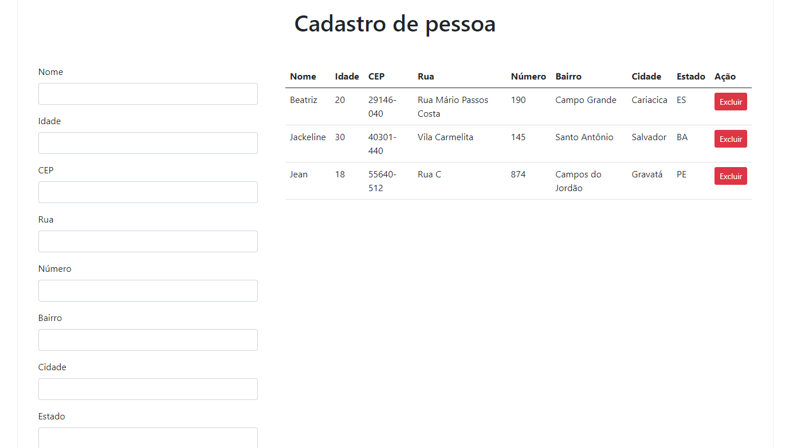

## :eye_speech_bubble: Visão Geral
A tela de cadastro de pessoas é um projeto pessoal acadêmico. Trata-se de uma single page para cadastro de pessoas, visualização das mesmas em uma tabela e possibilidade de exclusão geral (botão excluir todos) e individual. Vale ressaltar que é utilizada a API dos correios para preenchimento do endereço após inclusão do CEP pelo usuário.
## :books: Seções



## :computer: Tecnologias utilizadas

- HTML
- CSS
- Javascript
- Vue.Js
- Ajax
- Bootstrap


## :gear: Setup do projeto 

- Instale o projeto e suas dependências com o comando: 

```
npm install
```
- Rode o projeto em sua máquina e torne-o acessível pelo navegador com o seguinte comando:
```
npm run serve
```


### Customize configuration
See [Configuration Reference](https://cli.vuejs.org/config/).
